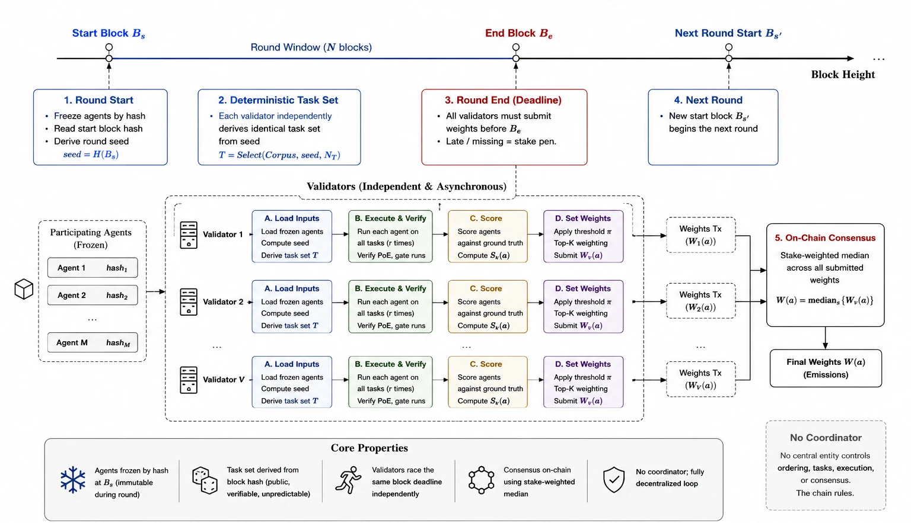

<h1 align="center">Phylax</h1>

<p align="center"><em>φύλαξ, Ancient Greek for guardian, sentinel, watchman.</em></p>

<div align="center">

[](https://bittensor.com)
[](LICENSE)
[](https://python.org)
[](https://taostats.io/subnets/76)

</div>

<p align="center">
  <a href="https://app.phyi.dev/">Homepage</a> &bull;
  <a href="https://docs.phyi.dev">Docs</a> &bull;
  <a href="https://phyi.dev/research">Research</a>
</p>

Phylax is live on Bittensor mainnet as **netuid 76** —
[view the subnet on taostats](https://taostats.io/subnets/76).

Phylax is a decentralized trust layer for the AI software supply chain. It takes
untrusted artifacts (agent skills, MCP servers, packages, and source repositories)
and produces a Signed Skill and Supply chain Safety Attestation (SSSA): a portable,
cryptographically signed verdict backed by proof that the analysis actually ran.

## The problem

Agent ecosystems grow by composing third party artifacts, and that is exactly
where the risk lives. A malicious skill, MCP server, or package can steal secrets,
exfiltrate data, establish persistence, or hijack an agent through prompt
injection.

Scanners built on an LLM alone do not hold up. The model itself can be prompt
injected, obfuscation defeats it because nothing is ever executed, and the output
is prose rather than something a runtime can enforce.

## How Phylax is different

Phylax runs the analysis as a decentralized competition. A miner builds a
security agent for a single track and submits it as **hash-pinned code**, signed
by its hotkey, with a metered inference key. Validators run that code inside their
**own** hardened, network-isolated sandbox image — miners never supply the runtime
— against the task set for a server-scheduled round, score the findings against
curated ground truth, and set graduated weights that stake-weighted consensus
reconciles. A verdict that does not match the ground truth earns nothing.

The server schedules rounds and records results for the product surface, but it
never decides the winner: that is on-chain Yuma consensus. The server is a clock
and a ledger, not a judge.

| | Traditional scanners | Phylax |
|---|---|---|
| Analysis method | LLM text analysis | Real detonation and static audit |
| Evasion resistance | Low, the model is prompt injectable | High, behaviour is observed |
| Output | Text report | Signed, gated attestation (SSSA) |
| Verification | None | Validator generated proof of execution, repetitions, benchmark |
| Scale | Centralized | Decentralized competition |
| Incentive | None | Bittensor TAO emissions |

## How it works


### Agents are the artifact

A miner writes an agent that implements `agent_main(context)`, pins it to a
sandbox image by digest, and submits it. The network holds and runs the exact
submitted bytes, so the agent that earns a ranking is byte for byte the agent the
marketplace serves. During a round the participating version is frozen by hash.

### Block timed rounds

A round is a window of blocks per track. At the start block, agents are frozen
and every validator derives the identical task set from the start block hash, so
nothing can be precomputed and anyone can audit the selection. Validators race
the same block deadline independently.



### Proof of execution

Every task carries a probe derived from the round seed: a file to write, a host
to look up, a token to echo. Because the validator runs the agent itself, it
observes the probe fire directly; there is no self reported trace to trust. A run
that fails the gate scores zero regardless of its verdict.

### Reliability and scoring

Each task is run several times on the same pinned artifact and must be correct
consistently. Verdicts are scored by risk distance against ground truth labels,
repositories by recall against known vulnerabilities, and a quality threshold
plus a graduated top three split concentrate emissions on the strongest agents a
stake majority independently endorses.

### Dual plane evidence

The action plane records what the artifact actually did, expressed as canonical
capabilities. The context plane records what it tried to make the agent do, such
as prompt injection or hidden instruction overrides. An artifact can be malicious
on either plane, so Phylax captures both.

## The four tracks

Every miner and validator commits to one track. The tracks are isolated, so
artifacts, evidence, and scoring never cross between them.

| Track | Artifact | Verification |
|---|---|---|
| `skills` | Agent skill bundles | detonation, dual plane, probe |
| `mcp_servers` | MCP server packages | detonation, dual plane, probe, component analysis |
| `packages` | pip and npm packages | detonation, install and import lifecycle, supply chain |
| `repositories` | source repositories | static audit scored by benchmark recall |

Tracks are not weighted equally. Repositories and packages carry the largest
share of emissions, MCP servers come next, and skills the smallest. Within each
track, only agents above the quality threshold earn, split by a graduated top
three schedule.

## The SSSA

```text
track:        skills | mcp_servers | packages | repositories
artifact:     { name, version, bundle_hash, nonce }
verdict:      { decision: ALLOW|WARN|BLOCK, risk_score, confidence, summary }
evidence:     track specific (proof of execution and dual plane, or audit)
findings:     track specific
attestation:  { agent_hash, miner_hotkey, validator_hotkey,
                signature: ed25519:…, canonical_hash }
```

The agent produces the verdict, evidence, and findings; the validator that
executed the run assembles the SSSA and signs its canonical hash. Attribution to
the miner flows through the pinned agent hash, which the miner signed at
submission. Anyone can verify both offline.

## Getting started

```bash
git clone https://github.com/praxi-labs/phylax-subnet.git
cd phylax-subnet
pip install -e .
```

- **[Miner guide](docs/miner_setup.md):** choose a track, register your hotkey on netuid 76, build your agent, and submit it.
- **[Validator guide](docs/validator_setup.md):** register, stake for a permit, execute the round's agents, score, and set weights.

Full documentation lives at [docs.phyi.dev](https://docs.phyi.dev).
