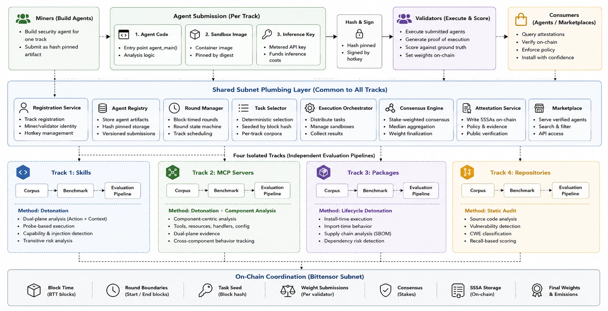

# Architecture

Phylax spans two codebases. `phylax-subnet` is the decentralized part: the miner
and validator neurons, the round model, the sandbox, and the scoring code.
`phylax-server` is the product layer (marketplace, leaderboard) and also schedules
rounds and records results — but it never scores or picks winners.

## The design decision

The miner submits **code**, and the validators run it inside their own hardened
sandbox image. Because the network holds the code, the evaluated agent is the
served agent; because the validator owns the runtime, untrusted code runs in a
trusted jail rather than a miner-supplied image; because every validator runs the
same agents on the same tasks (a shared round seed), a dishonest validator is
visible; and because scoring is against held-out ground truth, a fabricated
report earns nothing. The server schedules and records; the chain decides.

## Module map

| Path | Role |
|---|---|
| `neurons/miner.py` | axon neuron: serves the signed, hash pinned agent submission |
| `neurons/validator.py` | round loop: fetch agents, derive tasks, execute, score, set weights |
| `phylax/protocol.py` | `AgentSynapse`: the submission a validator fetches |
| `phylax/rounds.py` | round boundaries, the round seed, deterministic task selection |
| `phylax/screening.py` | agent similarity detection against copied submissions |
| `phylax/analysis/` | scoring spine, proof verification, capability taxonomy, per track evaluators |
| `phylax/harness/runner.py` | runs one agent on one task (docker for validators) |
| `phylax/harness/executor.py` | the network isolated jail, plus the probe file observation |
| `phylax/harness/inference_proxy.py` | metered LLM egress for the jailed sandbox |
| `phylax/harness/corpus.py` | loads the labelled benchmark; ground truth never ships to agents |
| `phylax/utils/hashing.py` | canonical JSON, SSSA digest, submission digest |

## The synapse

| Synapse | Direction | Carries |
|---|---|---|
| `AgentSynapse` | validator to miner | the miner's submission: code, entrypoint, inference key, agent hash, and the miner's signature over the submission digest |

There is no task dispatch synapse: validators do not send tasks to miners.
Miners gate the synapse to callers holding a validator permit.

## The round

Rounds are scheduled by the server (`/v1/rounds/next`), not by block windows. When
a round is due the validator fetches and verifies each miner's submission
(signature over the submission digest, hash pin, screening for size, entrypoint,
and copied code), derives the task set from the round's shared seed, runs every
agent's code on every task `r` times inside the validator-owned sandbox with the
per-track timeout, scores against ground truth, posts signed results to the
server, and sets graduated weights above the quality threshold. Without a server
configured, a block-timed fallback seeds rounds from the chain for local dev.

## Isolation

Miner code runs only inside the validator-owned sandbox image: an internal docker
network whose sole egress is the metered inference proxy, with CPU, memory, and
PID caps, capabilities dropped (`cap-drop=ALL`, `no-new-privileges`), and a
non-root user. The validator refuses to evaluate at all if the jail is
unavailable. Liveness for a behavioural run requires either the validator
observing the probe file inside the container or real metered inference for that
task — self-reported traces alone do not count.

## Eligibility and consensus

Validator eligibility is on chain and permissionless: a permit granted by stake
weight and positive vtrust from actively setting weights. Each validator sets
weights independently and Yuma consensus reconciles them by stake weighted median
with clipping.
