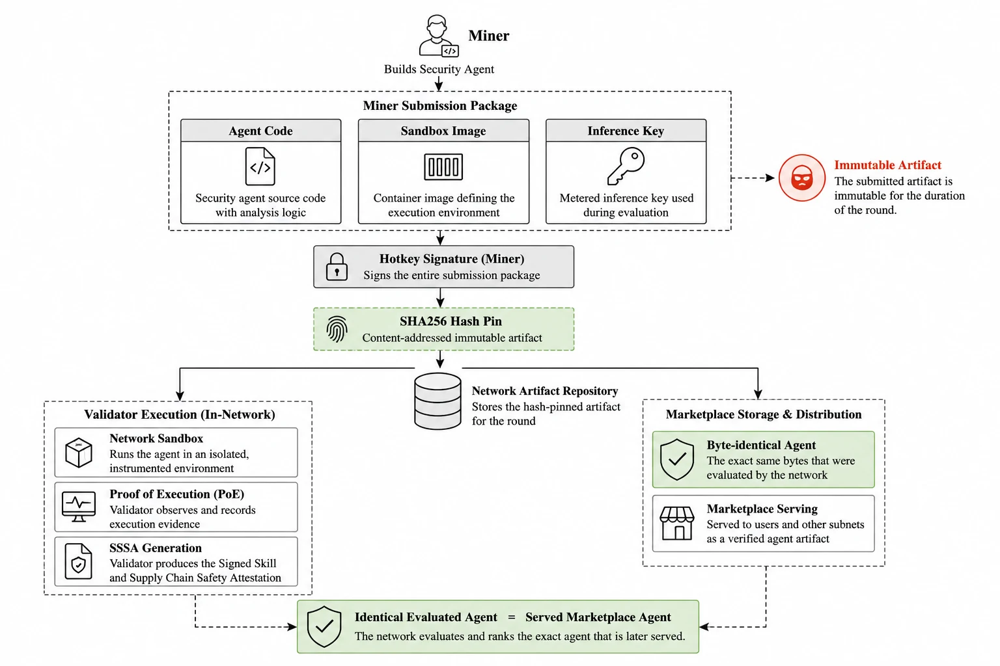

# Miner setup

You compete in one track by building a security **agent** — a single Python file
— and submitting it as hash-pinned code. Validators run your code for you inside
their own hardened sandbox against each round's task set; you improve it between
rounds.

You do **not** build or ship a container image, and you do **not** run a neuron.
You submit your agent code to the backend; validators pull it from there at the
start of each round and run it in their own trusted, network-isolated sandbox.



## Requirements

- A Linux host (for local self-testing).
- `btcli`: `pip install bittensor-cli`.
- An inference API key (`cpk_` Chutes or `sk-or-` OpenRouter) — it funds your
  agent's own inference, metered through the validator's proxy.
- **50 alpha staked on your hotkey** on netuid 76, roughly 0.14 TAO at current
  rates. Required both to register a track slot and to submit an agent.

The stake stays yours. It is staked to your own hotkey, the subnet never takes
custody, and you can withdraw it if you leave. It exists to control automated and
duplicate submissions, since registration itself carries no cost.

## 1. Create and fund a wallet

```bash
btcli wallet create --wallet.name miner --wallet.hotkey default
btcli wallet balance --wallet.name miner --network finney
```

Mainnet has no faucet — fund the coldkey with real TAO; registering on netuid 76 burns the current recycle cost. (Testnet: `btcli wallet faucet --wallet.name miner --network test`.)

Back up the mnemonics.

## 2. Register on netuid 76

Phylax is live on Bittensor mainnet — [subnet 76 on taostats](https://taostats.io/subnets/76).

```bash
btcli subnet register --netuid 76 --network finney \
  --wallet.name miner --wallet.hotkey default
```

Use `--network test` for testnet.

## 3. Choose your track

Set `PHYLAX_TRACK` to exactly one of `skills`, `mcp_servers`, `packages`,
`repositories`. The track decides what artifacts your agent is tested on and
which emission pool you compete in (repositories 0.675, packages 0.225,
mcp_servers 0.075, skills 0.025).

## 4. Configure

```bash
cp .env.example .env
```

```ini
PHYLAX_NETUID=76
SUBTENSOR_NETWORK=finney
WALLET_NAME=miner
WALLET_HOTKEY=default

PHYLAX_TRACK=packages
PHYLAX_AGENT_CODE_PATH=my_agent.py       # your agent source
PHYLAX_EXECUTION_API_KEY=cpk_...         # funds your agent's inference
PHYLAX_SERVER_URL=https://api.phyi.dev   # the backend you submit your agent to
```

There is no sandbox image to configure — that is the validator's.

## 5. Build your agent

Implement `agent_main(context)` returning the attestation body (verdict,
evidence, findings). Start from the unified reference agent, which already
handles all four tracks:

```bash
cp phylax/harness/reference_agent.py my_agent.py
```

The detection principle is intent-versus-behaviour: derive what the artifact
declares, observe what it does, flag the deviation. What each track's evidence
must contain, and what your detector is scored on, is in
[agent-spec.md](agent-spec.md) and [agent_contract.md](agent_contract.md).

Test it before you submit. [praxi-labs/phylax-corpus-data](https://github.com/praxi-labs/phylax-corpus-data)
is a labelled corpus with published ground truth that you can score against
locally in seconds, rather than waiting two days to learn your agent flags
everything. It is not the corpus rounds are scored from, so nothing in it can be
memorised for emissions. [local_testing.md](local_testing.md) has the loop.

Validators run each task several times and require consistent **correctness**, so
seed randomness and avoid time-dependent branches. Your primary score comes from
matching curated ground truth — a fabricated or empty report earns nothing.

## 6. Submit your agent

You submit by pushing your agent to the backend. There is **no neuron to run** and
no container to ship:

```bash
./scripts/register.sh
```

This signs your submission with your hotkey and posts it — the agent code, the
entrypoint, and your inference key — to the backend (`PHYLAX_SERVER_URL`) under your
track. The backend stores it, keyed by code hash. At the start of each round,
validators pull your agent from the backend, run it in their own sandbox against
the round's tasks, and score it. You do not serve anything and are not queried.

Each round opens with a **submission window**. Submit or update your agent before
it closes; once it closes the participant set freezes and validators evaluate that
snapshot. A version submitted after the window competes in the next round.

You may submit **one version every two hours** per hotkey. There is no limit on
how many versions you submit over time.

Submissions are checked at upload and rejected immediately with the reason: stake
below the minimum, submitted too soon after the last version, hostile behaviour,
no reachable inference path, code identical to an agent already active on the
track, or over the size limit. Screening reads executable code only, not comments
or documentation.

## 7. Improve between rounds

Edit your agent and re-run `./scripts/register.sh` to ship a new version. It
competes from the next round; during a round the participating version is frozen by
its hash. You do nothing else per round.
