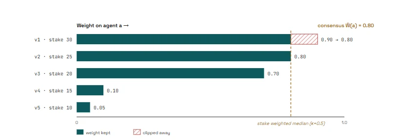

# Scoring

Each validator computes everything below from its own runs alone. Agreement
emerges afterwards, on chain, through Yuma consensus.

## Correctness on a single run

The validator compares the agent's reported risk to the ground truth label and
gates by proof of execution:

```text
c1(a, t) = g(a, t) x ( 1 - | risk(a, t) - y*(t) | )
```

`risk` is `verdict.risk_score / 100`, `y*` is 1.0 for known bad and 0.0 for known
good, and `g` is 1 only when the probe fired during the validator's own run and
the run finished inside the per task timeout.

## Reliability across repetitions

Each task is run `r` times. At least `ceil(ρ x r)` of the runs must be correct or
the task scores zero; otherwise the task score is the mean across repetitions.
The validator controls the repetitions with the same pinned artifact, so
reliability cannot be gamed.

## Solution quality

The per run score blends correctness with the track evaluator's solution quality
term, correctness dominant:

```text
run = g x ( 0.7 x correctness + 0.3 x quality )
```

## The round score

```text
S_v(a) = mean over the whole round task set
```

Failures and timeouts contribute zero, so hard artifacts cannot be quietly
skipped.

## Repositories: recall

The repository track audits statically and is scored against known
vulnerabilities: a finding matches when it agrees on CWE and file and localises
within a small line window. Recall is primary; clean repositories penalise
findings noise through precision. Ground truth lives beside the corpus entry and
never ships to the agent.

## From scores to weights

- **Quality threshold:** only agents with `S_v(a) > τ` (default 0.6) receive any
  weight.
- **Graduated split:** the top three eligible agents receive 0.50 / 0.30 / 0.20.
- **Pools:** 95% performance (split across tracks 0.675 repositories, 0.225
  packages, 0.075 mcp_servers, 0.025 skills), 5% contribution (equal split among
  recognized contributors active that epoch, folding back when none qualify).
- **Consensus:** Yuma computes the stake weighted median per agent and clips
  weights above it, so only agents a stake majority endorses earn materially.



## The capability taxonomy

Detonation evidence is expressed in canonical capabilities across ten groups
(filesystem, process and execution, network, secrets, database, cryptography,
system and host, source and repository, agent and tooling, context and
reasoning), each with a protection level of normal, dangerous, system, or
redact. Severity follows from the protection level, so honest agents converge on
the same vocabulary. See `phylax/analysis/capability.py`.
