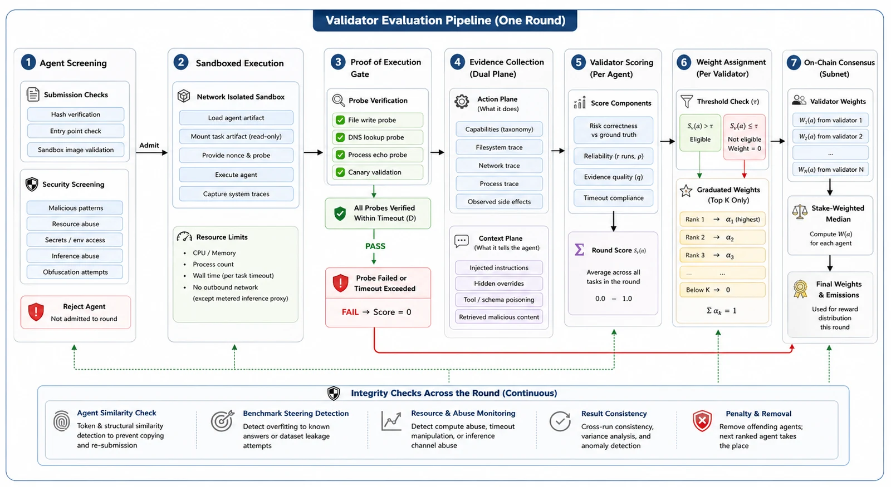

# Validator setup

A validator evaluates one track. When the server schedules a round it fetches the
participating agents, derives the task set from the round seed, runs every agent's
**code** inside its own hardened sandbox image, scores against ground truth, posts
signed results to the server, and sets graduated weights on chain.



## Requirements

- A Linux host with Docker and `docker compose`. The jail is mandatory: the
  validator refuses to evaluate if `PHYLAX_EXECUTOR` is not `docker`.
- `btcli`: `pip install bittensor-cli`.
- Enough stake to hold a validator permit.
- Capacity for `agents x tasks x repetitions x timeout` per round (divided by
  your parallelism).
- Outbound access to `ghcr.io`. The host pulls four public images —
  `phylax-validator`, `phylax-proxy`, `phylax-agent` (the sandbox), and
  `containrrr/watchtower` — so no registry login is needed. If your evaluations
  fail with `image pull failed`, the sandbox image is not reachable: confirm
  `phylax-agent` and `phylax-proxy` are Public on GHCR, or log in with a token.

## 1. Create and fund a wallet

```bash
btcli wallet create --wallet.name validator --wallet.hotkey default
btcli wallet faucet --wallet.name validator --network test
```

## 2. Register on netuid 486

```bash
btcli subnet register \
  --netuid 486 \
  --network test \
  --wallet.name validator \
  --wallet.hotkey default
```

## 3. Stake for a permit

```bash
btcli stake add --wallet.name validator --wallet.hotkey default --amount <TAO>
btcli wallet overview --wallet.name validator --network test
```

Eligibility is on chain and permissionless: a permit by stake weight and positive
vtrust once you start setting weights.

## 4. Install and configure

```bash
curl -fsSL https://raw.githubusercontent.com/praxi-labs/phylax-subnet/main/scripts/install.sh | bash -s validator
cd ~/phylax/validator
```

```ini
PHYLAX_NETUID=486
SUBTENSOR_NETWORK=test
WALLET_NAME=validator
WALLET_HOTKEY=default

PHYLAX_TRACK=skills
PHYLAX_EXECUTOR=docker
PHYLAX_SANDBOX_IMAGE=ghcr.io/praxi-labs/phylax-agent:latest  # the runtime you own
PHYLAX_INFERENCE_PROXY_URL=http://phylax-proxy:8900          # metered egress
PHYLAX_PROXY_ADMIN_TOKEN=<shared secret>                     # read inference liveness
PHYLAX_SERVER_URL=https://api.phyi.dev                       # round scheduler + results
PHYLAX_SERVER_HOTKEY=<pinned server hotkey>
DOCKER_GID=<host docker group gid>
```

Miner code runs inside `PHYLAX_SANDBOX_IMAGE`, not a miner-supplied image — this
is what lets untrusted code run in a trusted, hardened jail. The deploy compose
builds and sets this for you. If `PHYLAX_SERVER_URL` is unset the validator falls
back to a block-timed loop for local dev.

Optional tuning: `PHYLAX_TASKS_PER_ROUND`, `PHYLAX_REPETITIONS`,
`PHYLAX_TASK_TIMEOUT`, `PHYLAX_SCORE_THRESHOLD`, `PHYLAX_RELIABILITY_FRACTION`,
`PHYLAX_CORRECTNESS_FLOOR`, `PHYLAX_STATE_DIR`.

## 5. Run

```bash
docker compose pull && docker compose up -d
docker compose logs -f
```

This starts three containers: the validator neuron, the inference proxy, and
Watchtower.

## Staying current (auto-updates)

Watchtower is part of the validator deploy and runs automatically — it is not
optional. It watches the containers labelled
`com.centurylinklabs.watchtower.enable=true` (the validator and the proxy) and,
when we publish a new image, pulls it and restarts that container in place, one at
a time. This keeps every validator on the same build without anyone re-running
`docker compose pull`. It polls hourly by default; override with
`WATCHTOWER_POLL_INTERVAL` (seconds) in `.env`.

The **sandbox image** (`phylax-agent`) is handled separately and does not need
Watchtower: the executor runs `docker pull` on `PHYLAX_SANDBOX_IMAGE` before every
agent run, so as long as you leave `PHYLAX_SANDBOX_DIGEST` unset it always resolves
the latest `phylax-agent`. Pin `PHYLAX_SANDBOX_DIGEST` only when you deliberately
want a frozen, reproducible sandbox — that disables the per-run refresh.

## What happens each round

1. **Round trigger.** The validator polls the server (`/v1/rounds/next`). While the
   round's **submission window** is open the server reports a `submission` phase and
   the validator waits — miners are still submitting. When the window closes the
   server returns the round id, the shared seed, and the frozen participant set, and
   evaluation begins. Every validator working the round gets the same seed and set,
   so all evaluate the identical task set. (Without a server, a block-derived
   fallback seeds the round for local dev.)
2. **Fetch and screen.** For each participant in the round's frozen list, pull the
   agent from the backend (`GET /v1/specialization/agent/{hotkey}/runnable`); verify
   the fetched code hash matches the hash the backend froze; screen for size,
   entrypoint, and copied code (token-level similarity across submissions).
3. **Derive tasks.** The round seed deterministically selects tasks from the
   corpus, identically for every validator.
4. **Execute.** Run each agent's code on every task, `r` times, inside the
   validator-owned sandbox image (`cap-drop=ALL`, `no-new-privileges`, non-root,
   `--internal` network), funded by the miner's inference key through the metered
   proxy — the sandbox's only outbound path.
5. **Score.** Correctness against the label dominates (recall for repositories).
   A behavioural run must also pass liveness (the probe was observed, or real
   inference was metered for that task). The reliability rule counts runs the
   agent got *correct*, then averages over the task set.
6. **Publish + weights.** Post signed per-agent results and attestations to the
   server (`/v1/rounds/results`) — the server records them for the leaderboard and
   marketplace but never decides the winner. Apply the quality threshold, set
   graduated weights (0.50/0.30/0.20) on your top eligible agents on chain; Yuma
   consensus reconciles all validators by stake-weighted median with clipping.
   Each round also leaves a local record under `PHYLAX_STATE_DIR`.
